# Diagramas Técnicos — Trabajo de Grado

---

## 1. Arquitectura General del Sistema

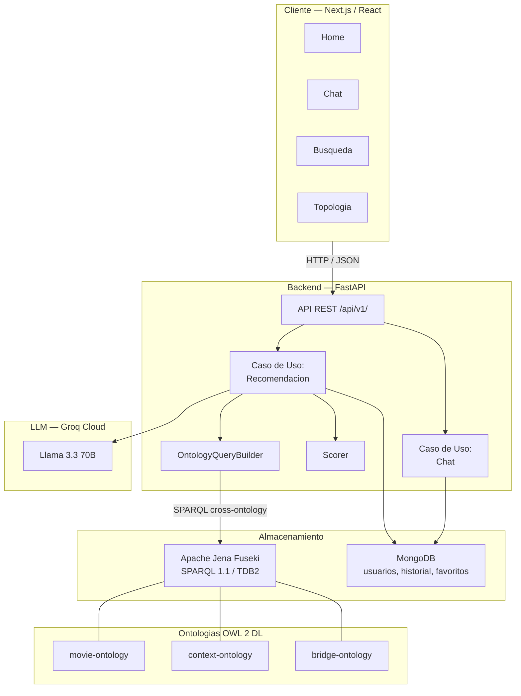

---

## 2. Pipeline de Recomendacion (5 Pasos)

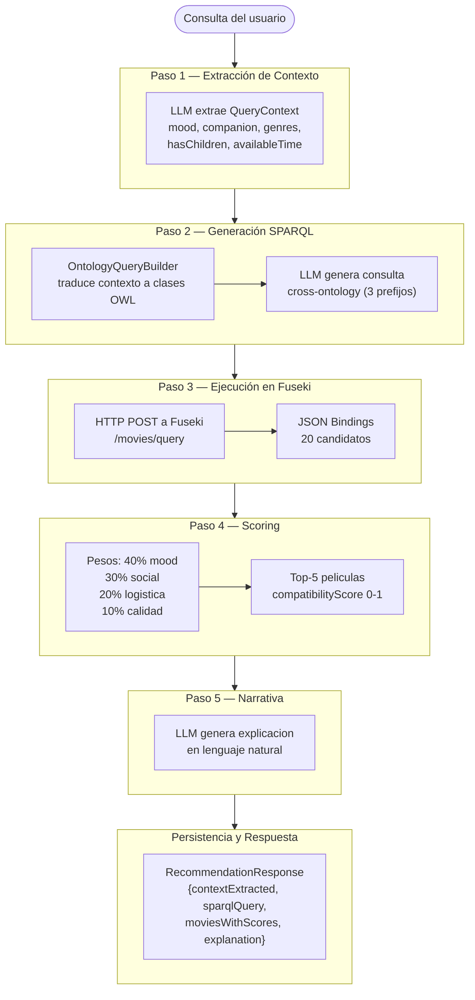

---

## 3. Pipeline ETL de Construccion de Ontologias

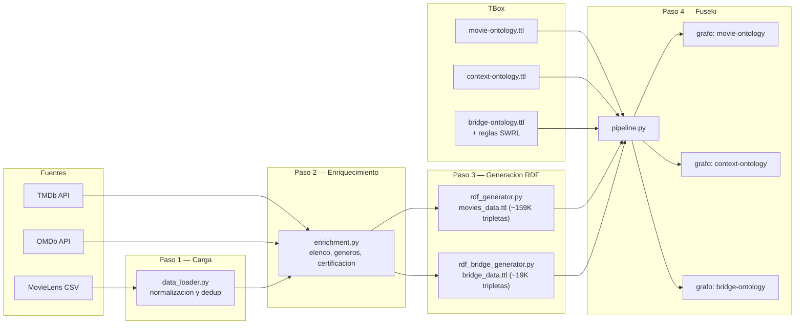

---

## 4. Estructura Modular de Ontologias

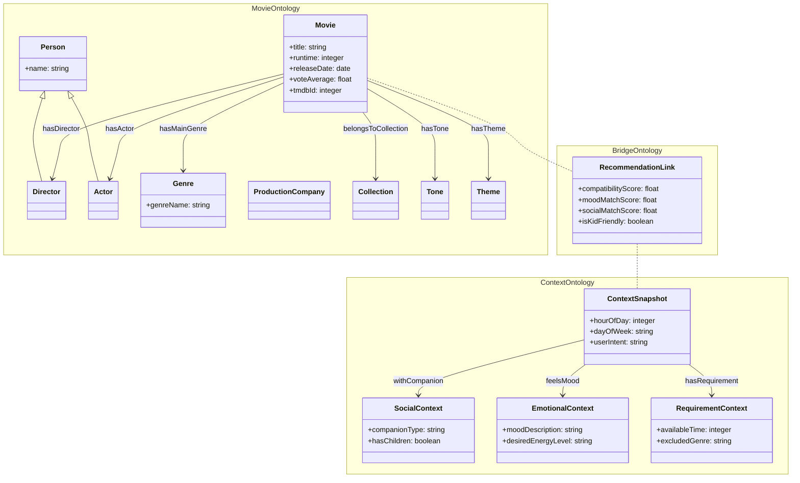

---

## 5. Flujo Conversacional Multi-turno

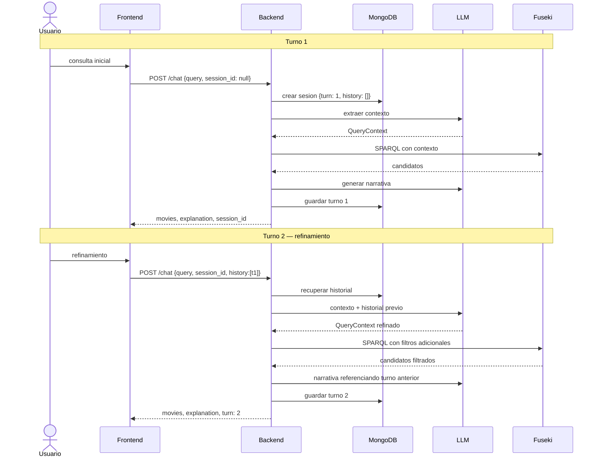

---

## 6. Estrategias de Consulta SPARQL

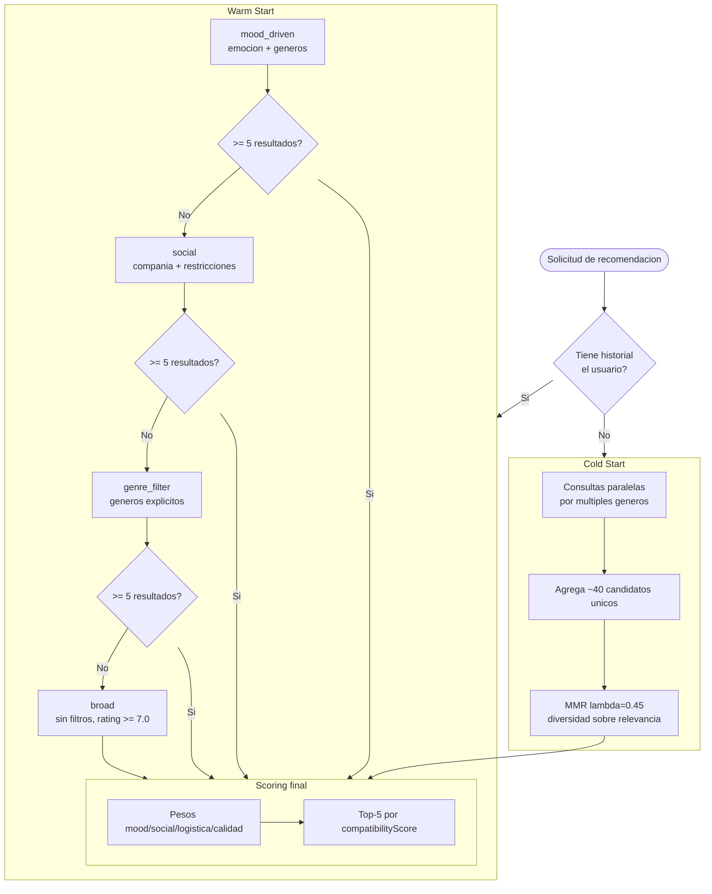

---

## 7. Diagrama de Clases del Dominio

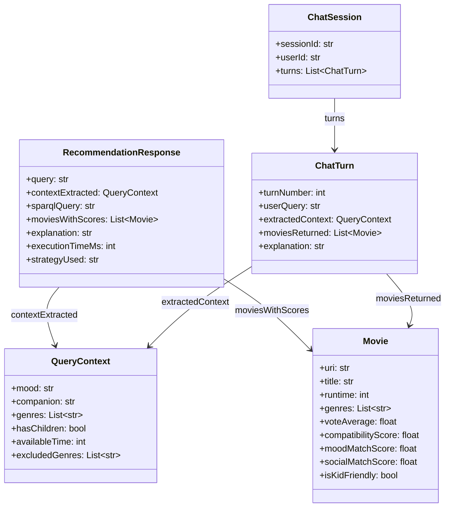

---

## 8. Arquitectura Hexagonal del Backend

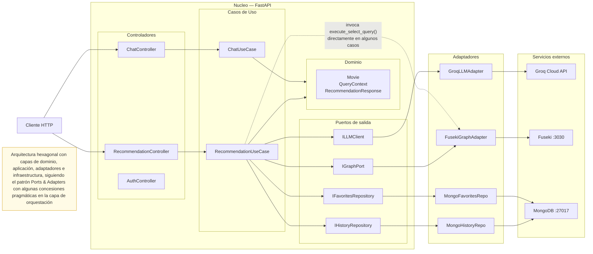

---

## 9. Flujo de Autenticacion JWT

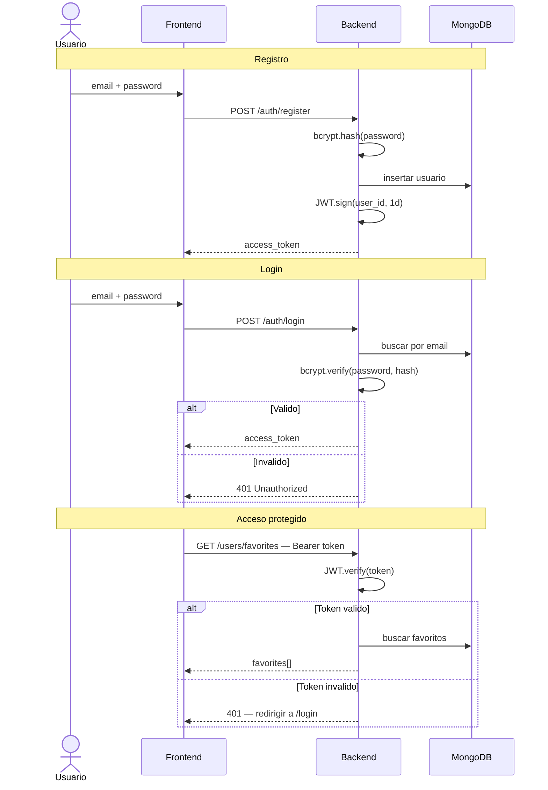

---

## 10. Consulta Cross-Ontology SPARQL

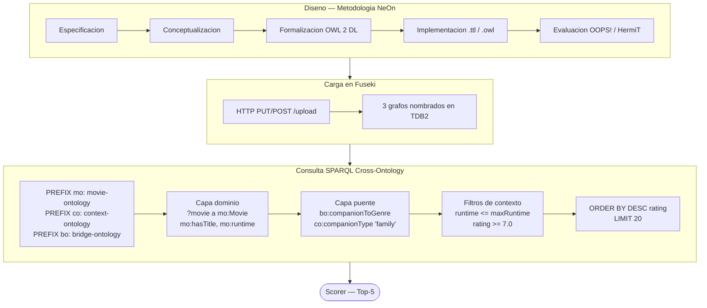

---

## 11. Componentes Frontend (Atomic Design)

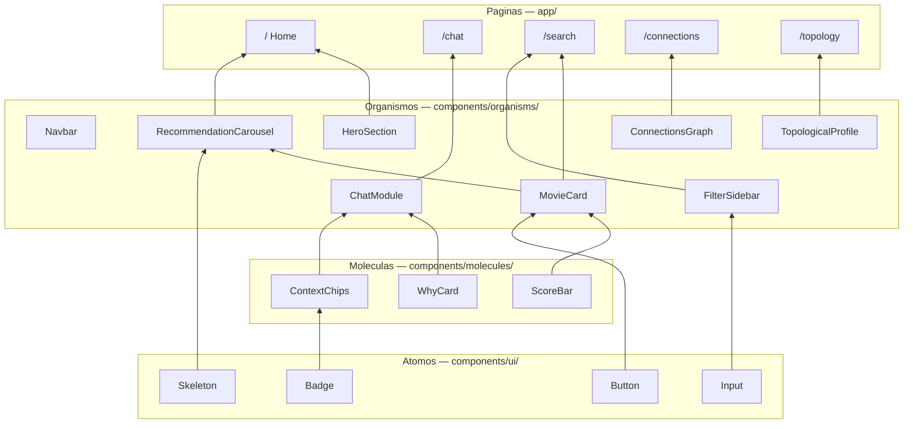

---

## 12. Despliegue (Docker Compose)

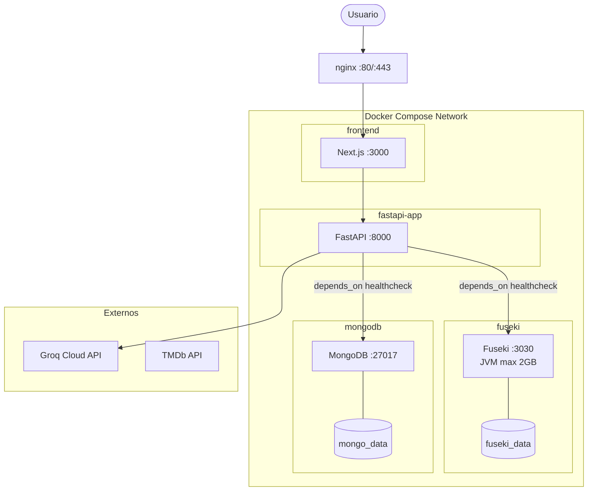

---

> **Exportar a PNG para LaTeX:**
> ```bash
> npm install -g @mermaid-js/mermaid-cli
> mmdc -i DIAGRAMAS_TESIS.md -o ./diagrams/ -t neutral -b white
> ```
