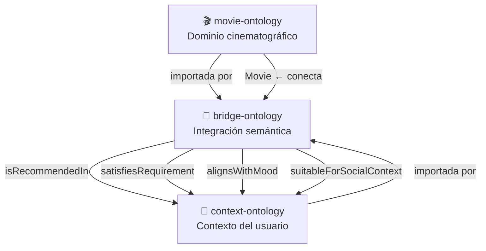
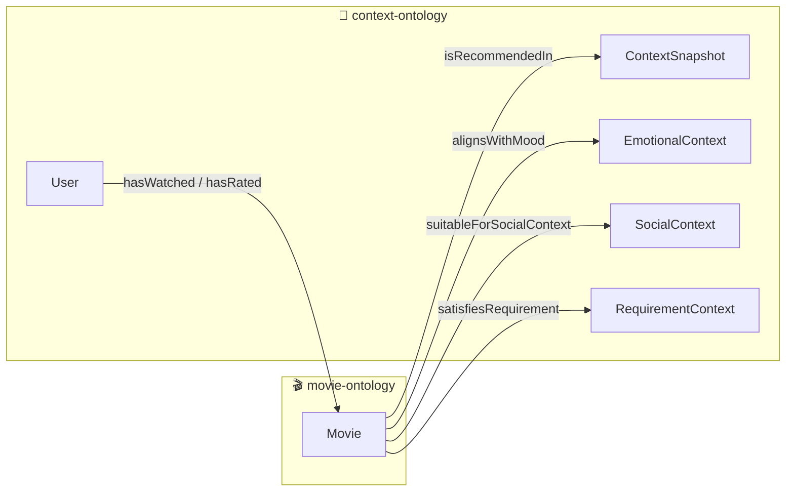
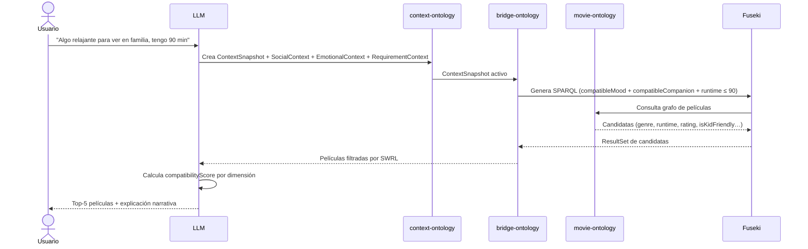

# Ontologías del Sistema MOVIQ

El sistema usa **tres ontologías OWL 2 DL** interdependientes que modelan el dominio cinematográfico, el contexto del usuario, y el puente semántico entre ambos mundos. Juntas conforman el grafo de conocimiento sobre el que se ejecutan las consultas SPARQL para generar recomendaciones explicables.

## Mapa de relaciones entre ontologías



---

## 1 — movie-ontology

> [!info] Identificador
> `http://www.semanticweb.org/movierecommendation/ontologies/2025/movie-ontology`
> Archivo: `data/ontologies/base/movie-ontology.ttl` · Versión 1.0

Modela el dominio cinematográfico completo. Es la ontología más grande del sistema. Define películas, personas, géneros, elementos narrativos, calificaciones, premios y clusters para GraphRAG.

Alineada con vocabularios externos: `schema:Movie`, `dbo:Film`, `foaf:Person`, `schema:Person`, `dbo:Award`.

### 1.1 Jerarquía de clases

```mermaid
classDiagram
    Entity <|-- Movie
    Entity <|-- Person
    Entity <|-- Attribute
    Entity <|-- Role
    Entity <|-- ProductionCompany
    Entity <|-- Certification
    Entity <|-- Award
    Entity <|-- MovieCluster

    Movie <|-- FeatureFilm
    Movie <|-- Documentary
    Movie <|-- ShortFilm
    Movie <|-- AnimatedFilm

    Person <|-- Director
    Person <|-- Actor
    Person <|-- Producer
    Person <|-- Screenwriter
    Person <|-- Cinematographer
    Person <|-- Composer
    Person <|-- Editor

    Attribute <|-- Genre
    Attribute <|-- Keyword
    Attribute <|-- NarrativeElement
    Attribute <|-- CulturalContext
    Attribute <|-- AgeRatingCategory
    Attribute <|-- Rating

    Genre <|-- MainGenre
    Genre <|-- Subgenre

    NarrativeElement <|-- Theme
    NarrativeElement <|-- Tone
    NarrativeElement <|-- PlotStructure

    Tone <|-- DramaticTone
    Tone <|-- ComedyTone
    Tone <|-- SuspensefulTone
    Tone <|-- RomanticTone
    Tone <|-- DarkTone

    PlotStructure <|-- LinearNarrative
    PlotStructure <|-- NonLinearNarrative
    PlotStructure <|-- EpisodicNarrative

    CulturalContext <|-- CountryOfOrigin
    CulturalContext <|-- HistoricalPeriod
    CulturalContext <|-- Language

    HistoricalPeriod <|-- Contemporary
    HistoricalPeriod <|-- Historical
    HistoricalPeriod <|-- Futuristic

    Role <|-- ActingRole
    Role <|-- CreativeRole
    ActingRole <|-- LeadRole
    ActingRole <|-- SupportingRole
    ActingRole <|-- CameoRole

    Award <|-- FilmAward
    Award <|-- PersonAward
    FilmAward <|-- BestPicture
    PersonAward <|-- BestDirector
    PersonAward <|-- BestActor
```



### 1.2 Propiedades de objeto principales

| Propiedad | Dominio | Rango | Inversa |
|---|---|---|---|
| `hasDirector` | `Movie` | `Director` | `isDirectorOf` |
| `hasActor` | `Movie` | `Actor` | `isActorIn` |
| `hasGenre` | `Movie` | `Genre` | `isGenreOf` |
| `hasMainGenre` | `Movie` | `MainGenre` | — |
| `hasKeyword` | `Movie` | `Keyword` | `isKeywordOf` |
| `hasProductionCompany` | `Movie` | `ProductionCompany` | `producedMovie` |
| `hasTone` | `Movie` | `Tone` | — |
| `hasTheme` | `Movie` | `Theme` | — |
| `hasPlotStructure` | `Movie` | `PlotStructure` | — |
| `hasCountryOfOrigin` | `Movie` | `CountryOfOrigin` | `isCountryOfOriginOf` |
| `hasLanguage` | `Movie` | `Language` | `isLanguageOf` |
| `hasRating` | `Movie` | `Rating` | — |
| `isSimilarTo` | `Movie` | `Movie` | *(simétrica)* |
| `belongsToCluster` | `Movie` | `MovieCluster` | `containsMovie` |
| `hasAwardParticipation` | `Movie\|Person` | `AwardParticipation` | — |

### 1.3 Propiedades de datos clave de `Movie`

| Propiedad | Tipo XSD | Cardinalidad | Notas |
|---|---|---|---|
| `hasTitle` | `string` | exactamente 1 | Funcional |
| `releaseDate` | `date` | exactamente 1 | Formato YYYY-MM-DD |
| `runtime` | `integer` | máx. 1 | En minutos (1–1000) |
| `hasPlotSummary` | `string` | máx. 1 | Usado para embeddings RAG |
| `hasIMDbID` | `string` | máx. 1 | Funcional |
| `hasTMDbID` | `string` | máx. 1 | Funcional |
| `hasPosterUrl` | `anyURI` | máx. 1 | URL del poster |
| `hasAverageRating` | `decimal` | máx. 1 | MovieLens (0–5) |
| `hasTMDbRating` | `decimal` | máx. 1 | TMDb (0–10) |
| `hasIMDbRating` | `decimal` | máx. 1 | IMDb (0–10) |
| `hasMetascore` | `integer` | máx. 1 | Metacritic (0–100) |
| `hasPopularity` | `decimal` | máx. 1 | TMDb (≥ 0) |
| `hasSimilarityScore` | `decimal` | máx. 1 | GraphRAG (0–1) |
| `hasToneValue` | `string` | múltiple | Valores separados por \| |
| `hasThemeValue` | `string` | múltiple | Valores separados por \| |

### 1.4 `MovieCluster` — GraphRAG

Clase especial para la navegación jerárquica en GraphRAG. Los clusters son detectados por algoritmos de comunidad (Louvain/Leiden sobre el grafo de co-aparición de géneros y keywords).

| Propiedad | Tipo | Descripción |
|---|---|---|
| `clusterID` | `string` | Identificador único (funcional) |
| `clusterLabel` | `string` | Nombre descriptivo corto (ej: *"Epic Sci-Fi"*) |
| `clusterDescription` | `string` | Descripción generada por LLM |
| `clusterSize` | `integer` | Número de películas en el cluster |
| `clusterCohesion` | `decimal` | Cohesión interna (0–1) |
| `clusterCentrality` | `decimal` | Importancia en el grafo (0–1) |

### 1.5 Restricciones y axiomas

> [!warning] Restricciones duras (OWL)
> - `Movie` debe tener **al menos 1** `Director` y **al menos 1** `MainGenre`
> - `Movie` debe tener **exactamente 1** título y fecha de estreno
> - `Director` debe haber dirigido **al menos 1** película
> - Los tipos de película (`FeatureFilm`, `Documentary`, `ShortFilm`, `AnimatedFilm`) son **disjuntos**
> - Los tonos narrativos son **disjuntos** entre sí
> - Las nueve clases raíz (`Movie`, `Person`, `Attribute`, `Role`, `ProductionCompany`, `Certification`, `Award`, `AwardParticipation`, `MovieCluster`) son **AllDisjointClasses**

---

## 2 — context-ontology

> [!info] Identificador
> `http://www.semanticweb.org/movierecommendation/ontologies/2025/context-ontology`
> Archivo: `data/ontologies/base/context-ontology.ttl` · Versión 1.0

Modela el contexto de la interacción del usuario en el momento de la recomendación. El principio central de diseño es que **ningún dato se solicita mediante formularios**: el LLM infiere toda la información a partir del lenguaje natural del usuario.

Solo tiene **5 clases** para mantener la simplicidad operacional.

### 2.1 Jerarquía de clases

```mermaid
classDiagram
    class ContextSnapshot {
        snapshotID: string
        requestTimestamp: dateTime
        userIntent: string
        dayOfWeek: string
        hourOfDay: integer [0-23]
    }
    class User {
        userID: string
        userName: string
    }
    class SocialContext {
        companionType: string
        hasChildren: boolean
        groupSize: integer [1-50]
    }
    class EmotionalContext {
        moodDescription: string
        emotionalNeed: string
        moodIntensity: decimal [0-1]
        desiredEnergyLevel: string
    }
    class RequirementContext {
        availableTime: integer [1-1000 min]
        contentRestrictions: string
        preferredLanguage: language
        excludedGenre: string
        negativeConstraint: string
    }

    User "1" --> "0..1" ContextSnapshot : hasCurrentContext
    ContextSnapshot "1" --> "0..1" SocialContext : withCompanion
    ContextSnapshot "1" --> "0..1" EmotionalContext : feelsMood
    ContextSnapshot "1" --> "0..1" RequirementContext : hasRequirement
```



### 2.2 Propiedades de objeto

| Propiedad | Dominio | Rango | Inversa | Cardinalidad |
|---|---|---|---|---|
| `hasCurrentContext` | `User` | `ContextSnapshot` | `isContextOfUser` | máx. 1 (funcional) |
| `withCompanion` | `ContextSnapshot` | `SocialContext` | `isCompanionIn` | máx. 1 |
| `feelsMood` | `ContextSnapshot` | `EmotionalContext` | `isMoodOfSnapshot` | máx. 1 |
| `hasRequirement` | `ContextSnapshot` | `RequirementContext` | `isRequirementOf` | máx. 1 |

### 2.3 Valores de vocabulario controlado

Los valores de las propiedades de datos siguen un vocabulario normalizado para garantizar consistencia con las consultas SPARQL.

**`companionType`**
```
solo · pareja · familia · familia con niños · familia extendida · amigos · compañeros de trabajo
```

**`desiredEnergyLevel`**
```
bajo · medio · alto
```

**`moodDescription`** (ejemplos inferibles)
```
relajado · estresado · alegre · triste · ansioso · emocionado · aburrido · curioso
concentrado · romántico · nostálgico · aventurero · nervioso · solo
```

**`compatibleTimeOfDay`** (bridge-ontology)
```
morning · afternoon · evening · night
```

### 2.4 Ejemplos de inferencia LLM → RDF

| Frase del usuario | Propiedades inferidas |
|---|---|
| *"algo ligero, tengo una hora"* | `moodDescription="relajado"`, `availableTime=60` |
| *"con los niños este fin de semana"* | `companionType="familia con niños"`, `hasChildren=true` |
| *"estoy estresado, necesito desconectarme"* | `moodDescription="estresado"`, `emotionalNeed="escapar del estrés"` |
| *"son las 3 AM, algo épico, nada de terror"* | `hourOfDay=3`, `desiredEnergyLevel="alto"`, `excludedGenre="horror"` |
| *"somos 6 amigos"* | `companionType="amigos"`, `groupSize=6` |
| *"nada de Marvel ni secuelas"* | `negativeConstraint="no Marvel, no sequels"` |

### 2.5 Restricciones y axiomas

> [!warning] Restricciones duras (OWL)
> - `User` debe tener **exactamente 1** `userID`
> - `ContextSnapshot` debe tener **exactamente 1** `snapshotID` y `requestTimestamp`
> - `hourOfDay` debe estar en el rango **[0, 23]**
> - `availableTime` debe estar en el rango **[1, 1000]** minutos
> - `moodIntensity` debe estar en **[0.0, 1.0]**
> - `groupSize` debe estar en **[1, 50]**
> - Las 5 clases son **AllDisjointClasses**
> - Un usuario tiene como máximo **1 contexto activo** simultáneo

---

## 3 — bridge-ontology

> [!info] Identificador
> `http://www.semanticweb.org/movierecommendation/ontologies/2025/bridge-ontology`
> Archivos: `data/ontologies/bridge/bridge-ontology.ttl` · `bridge-ontology-rules.owl` · Versión 2.1

Ontología de integración semántica. **No define clases nuevas**. Su único propósito es conectar `movie-ontology` y `context-ontology` mediante propiedades de puente, métricas de compatibilidad y reglas SWRL para filtrado lógico automático.

### 3.1 Arquitectura de integración



### 3.2 Propiedades de objeto (puente)

| Propiedad | Dominio | Rango | Inversa | Descripción |
|---|---|---|---|---|
| `isRecommendedIn` | `Movie` | `ContextSnapshot` | `recommends` | Película alineada con el snapshot activo |
| `satisfiesRequirement` | `Movie` | `RequirementContext` | `isSatisfiedBy` | Película que cumple restricciones logísticas |
| `alignsWithMood` | `Movie` | `EmotionalContext` | `isAlignedWith` | Película compatible con el estado emocional |
| `suitableForSocialContext` | `Movie` | `SocialContext` | `isSuitableFor` | Película apropiada para el contexto social |
| `hasWatched` | `User` | `Movie` | `wasWatchedBy` | Historial de visualización |
| `hasRated` | `User` | `Movie` | `wasRatedBy` | Películas calificadas (implica haberlas visto) |

### 3.3 Propiedades de datos de scoring

Todos los scores tienen rango `xsd:float` y están restringidos a **[0.0, 1.0]**.

| Propiedad | Descripción | Generada por |
|---|---|---|
| `compatibilityScore` | Compatibilidad global película-contexto | LLM (por request) |
| `moodMatchScore` | Alineación con estado emocional | LLM |
| `socialMatchScore` | Adecuación para el contexto social | LLM |
| `energyMatchScore` | Coincidencia con nivel de energía deseado | LLM |
| `requirementMatchScore` | Cumplimiento de restricciones logísticas | LLM |
| `timeMatchScore` | Proporción de períodos del día compatibles | Calculado (count/4) |

> [!note] `compatibilityScore` no es precomputado
> Se calcula dinámicamente en cada request por el LLM, combinando las 5 dimensiones anteriores más factores del dominio fílmico (rating, popularidad, pertinencia de géneros).

### 3.4 Propiedades de datos de compatibilidad precomputada

Estas propiedades se asignan a cada `Movie` durante el pipeline ETL. Permiten matching SPARQL directo sin intervención del LLM.

| Propiedad | Valores posibles | Cardinalidad |
|---|---|---|
| `compatibleMood` | `relajado`, `estresado`, `alegre`, … | múltiple |
| `compatibleCompanion` | `solo`, `pareja`, `familia`, `amigos`, … | múltiple |
| `compatibleEnergyLevel` | `bajo`, `medio`, `alto` | múltiple |
| `compatibleTimeOfDay` | `morning`, `afternoon`, `evening`, `night` | múltiple |
| `isKidFriendly` | `true` / `false` | funcional |

### 3.5 Reglas SWRL

#### Regla 1 — Runtime vs tiempo disponible

```
Movie(?m) ∧ RequirementContext(?req)
∧ runtime(?m, ?r) ∧ availableTime(?req, ?t)
∧ swrlb:lessThanOrEqual(?r, ?t)
→ satisfiesRequirement(?m, ?req)
```

> [!warning] Restricción dura
> Si una película no cumple `satisfiesRequirement`, debe excluirse del resultado aunque tenga `compatibilityScore` alto. El LLM puede relajar esta restricción solo si el usuario lo solicita explícitamente.

#### Regla 2 — Filtrado por edad (`hasChildren`)

```
IF SocialContext.hasChildren = true
THEN incluir solo Movie con certification IN ["G", "PG", "TV-Y", "TV-G"]
```

> [!note] Implementación
> Esta regla se implementa en el código del backend (no en el reasoner OWL) por limitaciones de SWRL con disyunciones sobre strings. El predicado `isKidFriendly` la sintetiza:
> - `G` → siempre `true`
> - `PG` → `true` solo si tiene género `Animation` o `Children`
> - `PG-13`, `R`, `NC-17` → siempre `false`

### 3.6 Interpretación de `compatibilityScore`

| Rango | Interpretación |
|---|---|
| 0.90 – 1.00 | Altamente recomendada (match casi perfecto) |
| 0.75 – 0.89 | Buena opción (coincide en la mayoría de dimensiones) |
| 0.60 – 0.74 | Opción aceptable (algunas coincidencias) |
| 0.00 – 0.59 | Baja compatibilidad (pocas coincidencias) |

---

## 4 — Flujo GraphRAG completo



### Estrategia de consulta progresiva (backend)

Cuando la consulta estricta no retorna suficientes resultados, el backend relaja los filtros en cascada:

```
strict          →  género + runtime exactos
relaxed_runtime →  solo género (relaja tiempo)
relaxed_genre   →  solo runtime (relaja género)
broad           →  solo rating mínimo
```

Si Fuseki no responde, el sistema hace **fallback** a señales de favoritos del usuario.

---

## 5 — Ejemplo SPARQL

Consulta que el sistema genera para *"algo relajado para ver en familia, 90 minutos"*:

```sparql
PREFIX movie: <http://www.semanticweb.org/movierecommendation/ontologies/2025/movie-ontology#>
PREFIX bridge: <http://www.semanticweb.org/movierecommendation/ontologies/2025/bridge-ontology#>

SELECT DISTINCT ?movie ?title ?runtime ?genre ?rating
WHERE {
    ?movie a movie:Movie ;
           movie:hasTitle ?title ;
           movie:runtime ?runtime ;
           movie:genreName ?genre ;
           movie:hasAverageRating ?rating .

    # Filtro contextual por mood compatible
    ?movie bridge:compatibleMood "relajado" .

    # Filtro por compañía compatible
    ?movie bridge:compatibleCompanion "familia" .

    # Filtro duro: runtime dentro del tiempo disponible
    FILTER(?runtime <= 90)

    # Filtro de contenido para familia con niños
    ?movie bridge:isKidFriendly true .

    # Rating mínimo de calidad
    FILTER(?rating >= 3.5)
}
ORDER BY DESC(?rating)
LIMIT 20
```

---

## 6 — Namespaces de referencia

| Prefijo | URI |
|---|---|
| `movie:` | `http://www.semanticweb.org/movierecommendation/ontologies/2025/movie-ontology#` |
| `context:` | `http://www.semanticweb.org/movierecommendation/ontologies/2025/context-ontology#` |
| `bridge:` | `http://www.semanticweb.org/movierecommendation/ontologies/2025/bridge-ontology#` |
| `schema:` | `http://schema.org/` |
| `dbo:` | `http://dbpedia.org/ontology/` |
| `foaf:` | `http://xmlns.com/foaf/0.1/` |

---

## 7 — Archivos del proyecto

| Archivo | Descripción |
|---|---|
| `data/ontologies/base/movie-ontology.ttl` | Ontología cinematográfica |
| `data/ontologies/base/context-ontology.ttl` | Ontología de contexto |
| `data/ontologies/bridge/bridge-ontology.ttl` | Ontología puente |
| `data/ontologies/bridge/bridge-ontology-rules.owl` | Reglas SWRL |
| `data/ontologies/instances/movies_data.ttl` | Instancias de películas (generadas por pipeline) |
| `data/ontologies/instances/bridge_data.ttl` | Conexiones película-contexto (generadas por pipeline) |
| `data/ontologies/VOCABULARIO_CONTROLADO.md` | Valores válidos de cada propiedad |
| `docs/figures/movie-ontology-diagram.png` | Diagrama visual de la ontología de películas |
| `docs/figures/context-ontology-diagram.png` | Diagrama visual de la ontología de contexto |
| `docs/figures/bridge-ontology-diagram.png` | Diagrama visual de la ontología puente |
| `docs/figures/ontology-integration.png` | Integración de las tres ontologías |
| `docs/figures/graphrag-flow.png` | Flujo completo GraphRAG |

---

*Universidad del Valle · Escuela de Ingeniería de Sistemas y Computación · 2026*
