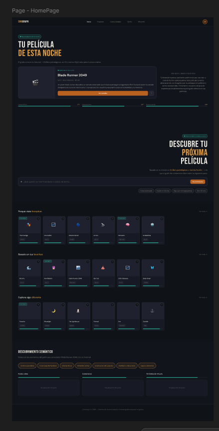
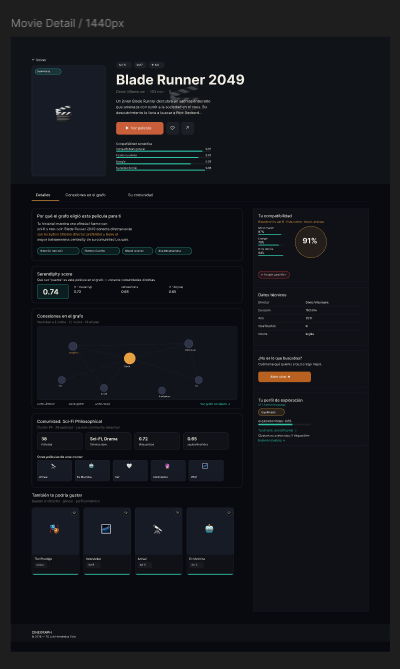
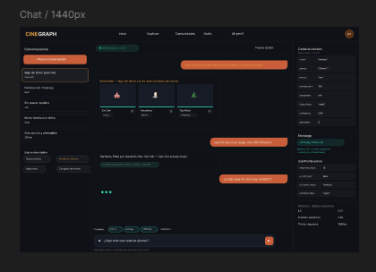
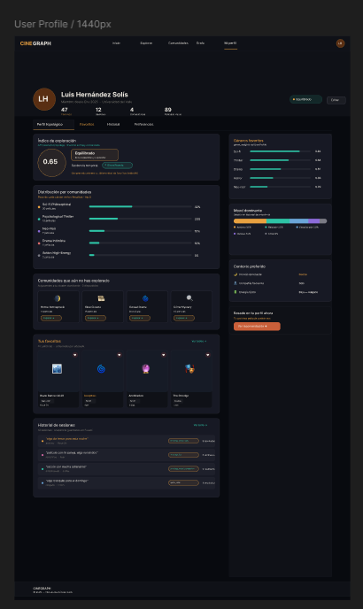
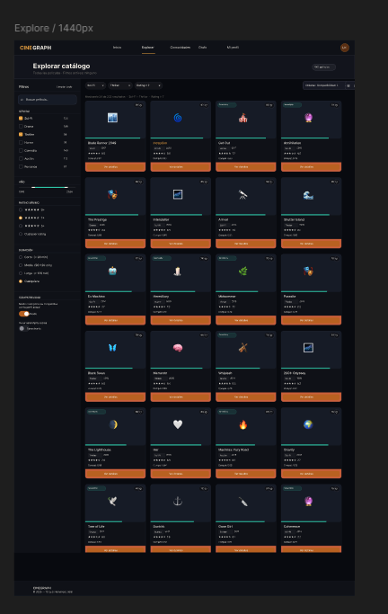

# CineGraph — Frontend Context para Claude Code

## Qué es este proyecto

CineGraph es el frontend de un sistema de recomendación cinematográfica basado en ontologías OWL y GraphRAG, desarrollado como trabajo de grado en la Universidad del Valle (Escuela de Ingeniería de Sistemas y Computación, Tuluá — 2025).

El sistema combina razonamiento ontológico sobre un grafo de conocimiento (Apache Jena Fuseki) con un LLM (Google Gemini 1.5 Flash) para generar recomendaciones contextualizadas y personalizadas. El frontend debe reflejar esa inteligencia: no es un catálogo de películas, es una interfaz que comunica razonamiento semántico.

---

## Stack tecnológico

| Capa | Tecnología |
|------|-----------|
| Framework | Next.js 14 (App Router) |
| Estilos | TailwindCSS (utility-first) |
| Estado global | Zustand |
| Tipado | TypeScript estricto |
| Fuentes | Bebas Neue (display) + DM Sans (body) — Google Fonts |
| Arquitectura de componentes | Atomic Design |

---

## Paleta de colores — Design tokens

Estos tokens son los únicos valores de color del sistema. No hardcodear valores fuera de ellos.

```ts
// tailwind.config.ts
colors: {
  bg:       '#080a0f',   // fondo total
  surface:  '#0f1117',   // cards, panels, navbar
  surface2: '#161b26',   // superficies elevadas, inputs
  text:     '#f0ece4',   // texto primario
  muted:    '#7a7870',   // texto secundario, placeholders
  accent:   '#e8a040',   // ámbar — acción principal, logo GRAPH, H1 accentuado
  accent2:  '#c95f3a',   // ámbar profundo — CTAs primarios, botones
  teal:     '#2ec4a6',   // teal — semántica, scores, badges activos
  border:   'rgba(255,255,255,0.07)',
  border2:  'rgba(255,255,255,0.13)',
}
```

**Reglas de uso:**
- `accent` → logo "GRAPH", H1 accentuado, highlights de sección, texto de énfasis
- `accent2` → botones CTA primarios (`Ver película`, `Recomiéndame`)
- `teal` → todo lo semántico: badges de score, indicadores de estrategia, contexto activo, serendipity
- `surface` → fondo de cards, navbar, sidebar, footer
- `surface2` → inputs, posters placeholder, zonas elevadas dentro de cards
- `muted` → metadata, subtítulos, labels secundarios, texto desactivado

---

## Tipografía

```ts
fontFamily: {
  display: ['Bebas Neue', 'sans-serif'],  // H1, logo, titulares hero
  body:    ['DM Sans', 'sans-serif'],     // todo lo demás
}
```

- `font-display` → solo para `H1`, el logo y titulares de sección grandes
- `font-body` → UI, cuerpo de texto, botones, labels, inputs

---

## Estructura de carpetas

```
/app
  /page.tsx                      ← HomePage
  /explore/page.tsx              ← Explorar catálogo
  /movies/[title]/page.tsx       ← Movie Detail
  /chat/page.tsx                 ← Chat conversacional
  /profile/page.tsx              ← Perfil del usuario

/components
  /atoms
    Button.tsx                   ← variants: primary | secondary | ghost | icon
    Input.tsx                    ← variants: text | prompt | chat
    Typography.tsx               ← H1-H4, Body, Caption
    Icon.tsx
    Tag.tsx                      ← variants: static | selectable
    Avatar.tsx
    Divider.tsx
    Loader.tsx                   ← spinner + skeleton shapes
    ScoreBar.tsx                 ← barra de compatibilidad semántica
    SerendipityBadge.tsx         ← badge para películas puente del grafo
  /molecules
    SearchPrompt.tsx             ← input + botón CTA
    MovieMeta.tsx                ← género · director · runtime · rating
    ActionGroup.tsx              ← favorito + detalles + compartir
    TagGroup.tsx                 ← colección de chips semánticos
    ScorePanel.tsx               ← panel de scores semánticos
    ChatInput.tsx                ← input + botón send
    ContextChips.tsx             ← chips de contexto acumulado del chat
    WhyCard.tsx                  ← "Por qué el grafo eligió esto"
    SessionItem.tsx              ← ítem del historial de sesiones
  /organisms
    Navbar.tsx
    HeroSection.tsx              ← componente crítico — ver spec abajo
    MovieCard.tsx
    RecommendationCarousel.tsx
    SemanticDiscovery.tsx        ← chips de mood/energía + sliders
    ChatModule.tsx
    MovieGrid.tsx                ← grid del catálogo con filtros
    FilterSidebar.tsx
    MovieDetailHero.tsx          ← hero de la pantalla de detalle
    GraphMinimap.tsx             ← mini grafo de vecindad (placeholder)
    ClusterSection.tsx           ← sección de comunidad Louvain
    TopologicalProfile.tsx       ← perfil de exploración del usuario
  /templates
    HomeTemplate.tsx
    ExploreTemplate.tsx
    MovieDetailTemplate.tsx
    ChatTemplate.tsx
    ProfileTemplate.tsx

/lib
  /api
    recommendation.ts            ← POST /api/v1/recommendation + chat
    movies.ts                    ← GET /api/v1/movies/search + connections
    connections.ts               ← GET /api/v1/movies/connections/*
    clusters.ts                  ← GET /api/v1/clusters
    users.ts                     ← GET /api/v1/users/me + /favorites
    graph.ts                     ← GET /api/v1/graph/topology
  /types
    movie.ts
    user.ts
    chat.ts
    cluster.ts
  /hooks
    useUserProfile.ts
    useChatSession.ts
    useMovieDetail.ts
    useExplore.ts
  /store
    chatStore.ts                 ← session_id, messages, contextAccumulated
    userStore.ts                 ← UserProfile, favorites
```

---

## Tipos de datos — contratos con el backend FastAPI

### RecommendedMovieResponse

```ts
type RecommendedMovie = {
  title: string
  posterUrl: string | null
  runtime: number | null          // minutos
  genreName: string | null
  releaseDate: string | null      // ej. "2020"
  averageRating: number | null
  compatibilityScore: number      // 0–1 — score principal
  moodMatchScore: number | null   // 0–1 — disponible en fases posteriores
  socialMatchScore: number | null // 0–1 — disponible en fases posteriores
  energyMatchScore: number | null // 0–1 — disponible en fases posteriores
  timeMatchScore: number | null   // 0–1 — disponible en fases posteriores
  kidFriendly: boolean | null
  serendipityScore: number        // 0–1 — Fase 10+: topological serendipity
}
```

### ContextExtracted

```ts
type ContextExtracted = {
  snapshotID?: string
  userIntent?: string
  hourOfDay?: number
  dayOfWeek?: string
  socialContext?: {
    companionType?: string
    hasChildren?: boolean
    numberOfPeople?: number
  }
  emotionalContext?: {
    moodDescription?: string
    desiredEnergyLevel?: string  // "bajo" | "medio" | "alto"
  }
  requirementContext?: {
    availableTime?: number
    excludedGenres?: string[]
    negativeConstraints?: string[]
  }
}
```

### RecommendationResponse

```ts
type RecommendationResponse = {
  query: string
  contextExtracted: dict[str, Any]
  rdfGenerated: string
  sparqlQuery: string
  moviesFound: number
  moviesWithScores: RecommendedMovie[]
  explanation: string
  executionTimeMs: number
  metrics?: {
    ild: number
    graphDiversityScore: number
    semanticPrecision: number
    coldStartThreshold: number
    movieCount: number
  }
  debugPayload?: dict[str, Any]
}
```

### ChatResponse

```ts
type ChatResponse = {
  session_id: string
  movies: RecommendedMovie[]
  explanation: string
  strategy_used: string
  context_extracted: dict[str, Any]
  execution_ms: number
  turn_count: number
  metrics?: { ... }
}
```

### TopologicalProfileResponse

```ts
type TopologicalProfile = {
  userId: string
  explorationIndex: number
  userType: string              // 'especialista' | 'equilibrado' | 'explorador'
  dominantClusters: Array<{
    clusterId: string
    label: string
    weight: number
    moviesSeen: number
  }>
  unexploredAdjacent: Array<{
    clusterId: string
    label: string
    distanceToDominant: number
  }>
  temporalTrend: string         // 'specializing' | 'diversifying' | 'stable'
  trendExplanation: string
  totalFavorites: number
  clusteredFavorites: number
}
```

---

## Endpoints — Backend FastAPI

| Páginas | Método | Endpoint | Parámetros |
|---------|--------|----------|-----------|
| Chat | `POST` | `/api/v1/recommendation` | `{ query: string }` |
| Chat (multi-turn) | `POST` | `/api/v1/recommendation/chat` | `{ session_id, messages }` |
| Explorar | `GET` | `/api/v1/movies/search` | `q`, `genre`, `director`, `yearFrom`, `yearTo`, `limit` |
| Movie Detail | `GET` | `/api/v1/movies/connections` | `from`, `to`, `maxDepth` |
| Movie Detail | `GET` | `/api/v1/movies/connections/neighborhood` | `title`, `depth` |
| Movie Detail | `GET` | `/api/v1/movies/connections/centrality` | `genre`, `limit` |
| Favoritos | `GET` | `/api/v1/users/me/favorites` | - |
| Favoritos | `POST` | `/api/v1/users/me/favorites` | - |
| Favoritos | `DELETE` | `/api/v1/users/me/favorites` | - |
| Perfil | `GET` | `/api/v1/graph/topology` | - |
| Clusters | `GET` | `/api/v1/clusters` | - |
| Clusters | `GET` | `/api/v1/clusters/{id}` | - |

---

## Especificación detallada — HeroSection

El componente más importante. Ocupa el 100vh en desktop.

**Layout:** `grid grid-cols-[8fr_4fr] gap-16 px-20`

**Columna izquierda:**
```
Badge teal animado: "● Recomendación del momento"
H1 font-display text-6xl:
  "Tu película"           → color: text
  "de esta"               → color: accent
  "noche"                 → color: accent
Subtexto (14px, muted):
  Generado desde UserProfile.dominantMood
SearchPrompt:
  placeholder: "O cuéntame qué quieres ver hoy…"
  icono: ✦ (prompt AI, no buscador)
  botón: "Recomiéndame" → color accent2
4 quick-chips:
  "Estoy estresado" | "Noche en familia" | "Algo que me haga pensar" | "Solo 90 min"
```

**Columna derecha — RecCard:**
```
Fuente: GET /api/v1/movies/connections/centrality
Poster (aspect-ratio 2:3)
Label teal: "● Elegida para ti · Esta noche"
Título en font-display
Meta: género · director · runtime
ScoreBar: compatibilityScore
WhyCard: explanation del backend
Botones: "Ver detalles" (primary) + "♡" (ghost)
```

---

## Especificación detallada — MovieCard

Usado en carouseles, grids y respuestas inline del chat.

```
Tamaño base: w-44 (carrusel) | w-64 (grid)
Poster: aspect-ratio 2:3, bg-surface2
Score bar: borde inferior, color teal→accent
Compat badge: esquina superior derecha, ej. "91%"
Fav button: esquina superior derecha
Info: título + género + año
Rating: estrellas + número
Hover: scale-[1.06] -translate-y-1 + box-shadow ámbar
CTA: "Ver detalles" en hover overlay
```

**SerendipityBadge:** Mostrar cuando `serendipityScore > 0.6`

---

## Especificación detallada — ChatModule

**Layout de `/chat`:**
```
Sidebar izq (300px): historial de sesiones
Chat central (860px): mensajes + input
Panel dcho (280px): contexto extraído (solo desktop)
```

**Comportamiento:**
- `session_id` se genera como UUID v4, persiste en `sessionStorage`
- Enviar `POST /api/v1/recommendation/chat` con `{ session_id, messages: [...] }`
- Mostrar `ContextChips` sobre el input
- Hasta 5 `MovieCard` inline en respuestas
- Indicador de escritura (`● ● ●`) durante request
- Panel derecho muestra `context_extracted`, `strategy_used`, `metrics`

**Burbujas:**
- Usuario: `bg-accent2`, derecha, border-radius asimétrico
- Sistema: `bg-surface`, borde `border-border2`, izquierda, avatar `✦` teal

---

## Carouseles de la homepage

| Sección | Endpoint |
|---------|----------|
| "Porque viste [X]" | `GET /api/v1/movies/connections/neighborhood?title=X` |
| "Basado en tus favoritos" | `GET /api/v1/movies/connections/centrality?genre=...` |
| "Explora algo diferente" | `GET /api/v1/movies/connections/centrality` (filtrar por `serendipityScore`) |

---

## Chips semánticos — mapeo al bridge-ontology

```ts
const MOOD_CHIPS = [
  { label: 'Mente desbordante', bridgeValue: 'curioso' },
  { label: 'Emocionalmente intenso', bridgeValue: 'triste' },
  { label: 'Oscuro y perturbador', bridgeValue: 'ansioso' },
  { label: 'Giro de trama', bridgeValue: 'emocionado' },
  { label: 'Visualmente impactante', bridgeValue: 'concentrado' },
  { label: 'Tenso y silencioso', bridgeValue: 'nervioso' },
  { label: 'Ligero y divertido', bridgeValue: 'alegre' },
  { label: 'Complejo y simbólico', bridgeValue: 'curioso' },
  { label: 'Romántico', bridgeValue: 'romantico' },
  { label: 'Distopía', bridgeValue: 'ansioso' },
  { label: 'Inspiracional', bridgeValue: 'concentrado' },
  { label: 'Nostálgico', bridgeValue: 'nostalgico' },
]
```

---

## Perfil topológico — visualización

```ts
const CLASSIFICATION_STYLES = {
  especialista: 'bg-red-900/20 text-red-400 border-red-800',
  equilibrado: 'bg-accent/10 text-accent border-accent/30',
  explorador: 'bg-teal/10 text-teal border-teal/30',
}

const TREND_LABELS = {
  specializing: '↘ Especializando',
  diversifying: '↗ Diversificando',
  stable: '→ Estable',
}
```

---

## Animaciones y transiciones

```ts
// tailwind.config.ts
{
  'pulse-dot': 'pulse 2s ease-in-out infinite',
  'fade-in': 'fadeIn 0.3s ease-out',
  'slide-up': 'slideUp 0.4s cubic-bezier(0.34,1.56,0.64,1)',
  'fill-bar': 'fillBar 0.6s ease-out forwards',
}

// keyframes
{
  fadeIn: { from: { opacity: '0' }, to: { opacity: '1' } },
  slideUp: { from: { opacity: '0', transform: 'translateY(12px)' }, to: { opacity: '1', transform: 'translateY(0)' } },
  fillBar: { from: { width: '0%' }, to: { width: 'var(--fill-width)' } },
}
```

---

## Reglas de implementación — NO hacer

- No hardcodear colores fuera de tokens
- No mezclar responsabilidades entre átomos/páginas
- No crear componentes monolíticos
- No usar `any` en TypeScript
- No llamar `fetch` directamente — usar `/lib/api/`
- No renderizar campos `null` sin validación
- No mostrar `kidFriendly: false` sin indicador visual

## Reglas de implementación — SÍ hacer

- Cada átomo maneja: `hover`, `active`, `disabled`, `loading`
- `ScoreBar` muestra valor numérico (ej. `0.91`)
- `SerendipityBadge` cuando `serendipityScore > 0.6`
- Posters con `next/image`, `fill`, `object-cover`
- `session_id` en `sessionStorage`
- `WhyCard` siempre tiene contenido de backend
- Scores adicionales se renderizarán cuando estén disponibles

---

## Prioridad de implementación

1. Tokens de color + tipografía en `tailwind.config.ts`
2. Átomos: `Button`, `Input`, `Tag`, `ScoreBar`, `Avatar`, `Loader`, `SerendipityBadge`
3. `MovieCard`
4. `HeroSection`
5. `Navbar`
6. `RecommendationCarousel`
7. `ChatModule` + `ChatInput` + `ContextChips`
8. `HomeTemplate` → `HomePage`
9. `FilterSidebar` + `MovieGrid`
10. `MovieDetailTemplate`
11. `ChatTemplate`
12. `ProfileTemplate` + `TopologicalProfile`





